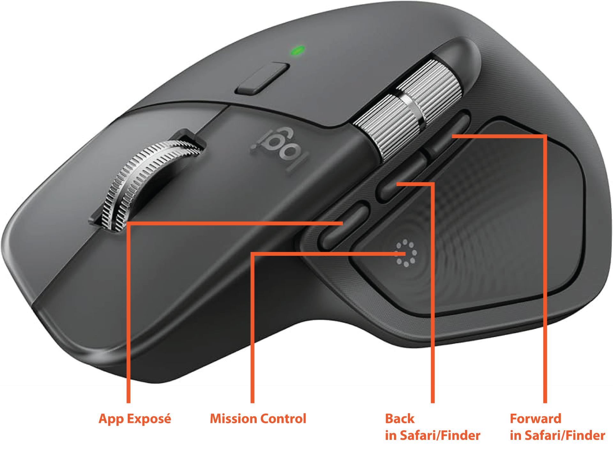

# MouseNavigate

<p align="center">
  
</p>

Global mouse side-button navigation for macOS.

## Device Support

- Supported: Logitech MX4
- TODO: Logitech MX3

## Behavior

- Button `3` -> Back (`⌘ + [`) in Safari/Finder
- Button `4` -> Forward (`⌘ + ]`) in Safari/Finder
- Button `5` -> App Exposé system-wide (uses your configured Mission Control shortcut if enabled)
- Button `6` -> Mission Control system-wide (uses your configured Mission Control shortcut if enabled)
- Single-instance guard: launching again shows `MouseNavigate is already running.`
- Low-memory mode: `.app` launch acts as a small launcher and runs a lightweight background daemon for mouse handling.

## Quick Start

1. Build app bundle:
```bash
./scripts/build-app.sh
```

2. Install:
```bash
cp -R dist/MouseNavigate.app /Applications/
```

3. Launch:
```bash
open /Applications/MouseNavigate.app
```

4. Grant permissions:
- `System Settings` -> `Privacy & Security` -> `Accessibility`
- `System Settings` -> `Privacy & Security` -> `Input Monitoring` (if prompted)

## Build

```bash
swift build
```

## Build .app Bundle

```bash
./scripts/build-app.sh
```

Use stable signing (recommended for Accessibility permission persistence):

```bash
security find-identity -v -p codesigning
SIGN_IDENTITY="Apple Development: Your Name (TEAMID)" ./scripts/build-app.sh
```

If `SIGN_IDENTITY` is not set, the script tries to auto-pick an `Apple Development` identity.
If none is found, it falls back to ad-hoc signing (`-`), which may require re-adding Accessibility permission after rebuilds.

This creates:

```bash
dist/MouseNavigate.app
```

## Run from Source

```bash
swift run
```

Or run the built binary directly:

```bash
./.build/debug/MouseNavigate
```

## Security & Privacy

- MouseNavigate listens to global side-button mouse events.
- MouseNavigate sends local keyboard/system actions.
- MouseNavigate requires macOS Accessibility/Input Monitoring permissions.
- MouseNavigate does not require network access to function.

## Gatekeeper Notes

- If app is ad-hoc signed, macOS may warn on first launch.
- For stable identity and fewer permission resets, sign with a persistent development certificate.

## Images



## Versioning

- Current release: `0.1.0`
- Create a git tag for release:
```bash
git tag v0.1.0
git push origin v0.1.0
```

## Icon Attribution

- App icon source: Noun Project, "Mouse Navigation" by Sergey Demushkin
  https://thenounproject.com/icon/mouse-navigation-376186/
- Ensure your use complies with Noun Project license terms/attribution requirements.
