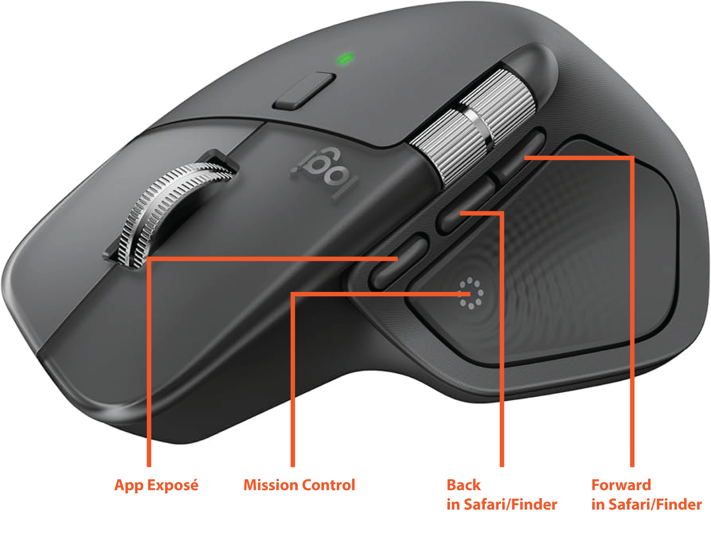

# MouseNavigate

<p align="center">
  
</p>

Global mouse side-button navigation for macOS.

## Why This Project

I wanted simple mouse side-button behavior on macOS without running a heavy helper suite.
MouseNavigate focuses only on the button mapping logic and keeps everything minimal.

## Device Support

- Supported: Logitech MX4
- TODO: Logitech MX3

## Behavior

- Buttons `3`–`6` are individually configurable via **Preferences** (see [Button Mapping](#button-mapping) below).
- Default mapping:
  - Button `3` → Back (`⌘[`) in supported browsers & Finder
  - Button `4` → Forward (`⌘]`) in supported browsers & Finder
  - Button `5` → App Exposé system-wide (uses your configured Mission Control shortcut if enabled)
  - Button `6` → Mission Control system-wide (uses your configured Mission Control shortcut if enabled)
- Single-instance guard: launching again shows `MouseNavigate is already running.`
- Background daemon architecture: `.app` launch starts a lightweight background daemon, keeping the main process footprint minimal.

## Status Bar

- While running, MouseNavigate shows a mouse icon (🖱) in the macOS menu bar.
- The icon is a gray/white template image that automatically adapts to light and dark menu bar appearances.
- When **Paused**, the icon switches to an outline mouse to indicate navigation is suspended.
- Hover the icon to see a tooltip confirming the running or paused state.
- Right-click (or click) the icon for the context menu:
  - **MouseNavigate** / **vX.Y.Z** — app name and version header (non-interactive)
  - **⚠ Grant Accessibility Permission…** — shown only when the permission has been revoked; clicking opens System Settings → Accessibility directly
  - **Pause** / **Resume** — temporarily suspends all button handling without quitting
  - **Launch at Login** ✓ — toggle to start MouseNavigate automatically at login
  - **Preferences…** — open the Button Mapping window
  - **Quit MouseNavigate** — stops the daemon

## Button Mapping

Open **Preferences…** from the status bar menu to configure each button.

| Button | Default | Available actions |
|--------|---------|-------------------|
| 3 | Back (`⌘[`) | Back, Forward, App Exposé, Mission Control, Disabled |
| 4 | Forward (`⌘]`) | Back, Forward, App Exposé, Mission Control, Disabled |
| 5 | App Exposé | Back, Forward, App Exposé, Mission Control, Disabled |
| 6 | Mission Control | Back, Forward, App Exposé, Mission Control, Disabled |

Changes apply immediately and persist across restarts (stored in `UserDefaults` suite `com.vinhry.MouseNavigate`).

**Back / Forward — supported apps:**
Safari, Finder, Chrome, Chrome Canary, Firefox, Firefox Developer Edition, Arc, Brave, Edge, Opera, Vivaldi, Orion

## Resource Usage

- Designed for idle background use.
- Typical idle usage: about `20–30 MB` memory and around `0%` CPU most of the time.
  - The daemon runs `NSApplication` with a status bar item, which loads AppKit — the primary baseline cost. The `ServiceManagement` framework (Launch at Login) adds a small fixed overhead on top.
  - Opening Preferences for the first time allocates the mapping panel (~2 MB additional); it stays resident until the app quits.
- No network activity required.

## Quick Start

1. Build app bundle:
```bash
./scripts/build-app.sh
```

2. Install:
```bash
cp -R dist/MouseNavigate.app /Applications/
```

3. Launch:
```bash
open /Applications/MouseNavigate.app
```

4. Grant permissions:
- `System Settings` -> `Privacy & Security` -> `Accessibility`
- `System Settings` -> `Privacy & Security` -> `Input Monitoring` (if prompted)

## Build

```bash
swift build
```

## Build .app Bundle

```bash
./scripts/build-app.sh
```

Use stable signing (recommended for Accessibility permission persistence):

```bash
security find-identity -v -p codesigning
SIGN_IDENTITY="Apple Development: Your Name (TEAMID)" ./scripts/build-app.sh
```

If `SIGN_IDENTITY` is not set, the script tries to auto-pick an `Apple Development` identity.
If none is found, it falls back to ad-hoc signing (`-`), which may require re-adding Accessibility permission after rebuilds.

This creates:

```bash
dist/MouseNavigate.app
```

## Run from Source

```bash
swift run
```

Or run the built binary directly:

```bash
./.build/debug/MouseNavigate
```

## Security & Privacy

- MouseNavigate listens to global side-button mouse events.
- MouseNavigate sends local keyboard/system actions.
- MouseNavigate requires macOS Accessibility/Input Monitoring permissions.
- MouseNavigate does not require network access to function.

## Gatekeeper Notes

- If app is ad-hoc signed, macOS may warn on first launch.
- For stable identity and fewer permission resets, sign with a persistent development certificate.

## Images



## Versioning

- Current release: `0.1.0`
- Create a git tag for release:
```bash
git tag v0.1.0
git push origin v0.1.0
```

## Icon Attribution

- App icon source: Noun Project, "Mouse Navigation" by Sergey Demushkin
  https://thenounproject.com/icon/mouse-navigation-376186/
- Ensure your use complies with Noun Project license terms/attribution requirements.
